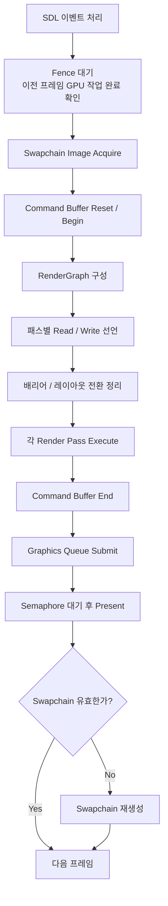
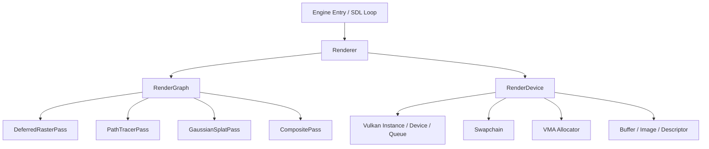
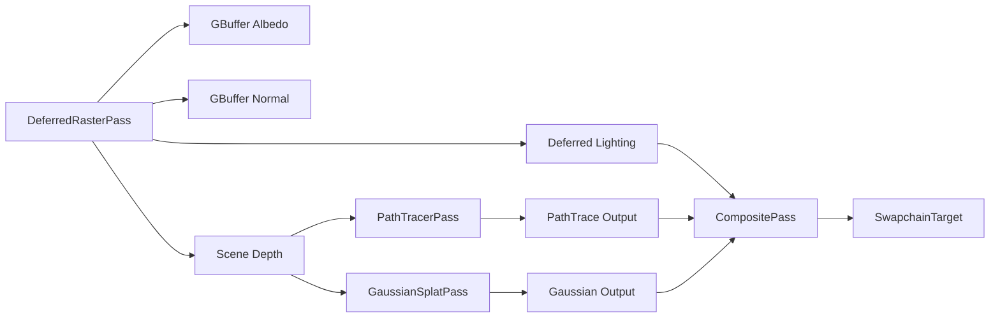

개인 프로젝트로 전부터 해 보고 싶던 Vulkan 렌더링 엔진을 만들어보려 한다.

내 이해력와 능력의 한계를 시험해보고 싶기도 하고, 현재까지의 지식과 경험을 집대성해야만 마칠 수 있는 프로젝트라고 생각하니 멋지기도 하고, 무엇보다 생물이든 무생물이든 예전부터 뭔가 움직이는 걸 가만히 보고 있는 것 만으로도 좋아하기 때문이다.

기본적인 레스터라이저나 레이트레이서 등을 구현해 보며 그래픽스 이론에 대한 얕은 경험은 있지만, 그래픽스 라이브러리에 대한 지식은 거의 없으므로 정리하며 넘어가야 기억에 오래 남을 것 같다.

레스터라이저나 간단한 레이트레이서 같은 것들을 직접 구현해 보면서 그래픽스 이론을 아주 얕게나마 건드려 본 적은 있다. 다만 그래픽스 API, 특히 Vulkan처럼 저수준 라이브러리를 실전 코드로 다루는 경험은 거의 없었다. 그래서 이번에는 그냥 만들고 끝내는 게 아니라, 중간중간 내가 이해한 것을 정리하면서 가 보기로 했다. 지금은 알 것 같아도 정리하지 않으면 금방 흐려지고, 나중에 다시 봤을 때 왜 그렇게 구현했는지 스스로도 설명하지 못하는 일이 많기 때문이다.

이번 글은 지금까지 한 작업을 간단히 정리하고, 현재 내가 잡아 둔 아키텍처와 그 이유, 채택한 써드파티 라이브러리들, 그리고 직접 구현하면서 헷갈렸던 개념들을 기록해 두려는 목적에 가깝다.

## 지금까지 한 일

현재 단계에서 눈에 띄는 결과물은 아직 많지 않다. 거창한 장면이 돌아가거나, 복잡한 에셋이 로드되는 상태도 아니다. 대신 그 전에 필요한 기반 작업을 먼저 깔아 두는 중이다.

지금까지 한 일은 대략 이렇다.

- SDL로 Vulkan 창 생성
- Vulkan validation layer를 켠 상태로 초기화 경로 구성
- Vulkan instance, surface, physical device, logical device 생성
- VMA allocator 연결
- swapchain 생성 및 재생성 경로 구성
- 프레임 단위 command pool, command buffer, fence, semaphore 준비
- 렌더러와 render graph 구조 작성
- 여러 렌더 패스를 등록하고 프레임마다 실행 순서를 관리하는 구조 작성
- 셰이더 소스를 CMake 단계에서 SPIR-V로 컴파일하는 경로 구성

## 현재 프레임 흐름

지금 프로젝트에서 한 프레임은 대략 이런 식으로 흘러간다.

1. SDL 이벤트 루프를 돌면서 창 상태를 확인한다.
2. CPU는 fence를 통해 이전 프레임 GPU 작업이 끝났는지 확인한다.
3. swapchain에서 이번 프레임에 사용할 이미지를 acquire한다.
4. 커맨드 버퍼를 초기화하고 이번 프레임의 render graph를 구성한다.
5. 각 패스는 자신이 어떤 리소스를 읽고 어떤 리소스를 쓰는지 선언한다.
6. render graph는 이 정보를 바탕으로 이미지 레이아웃 전환과 배리어를 정리한다.
7. 커맨드 버퍼를 GPU 큐에 제출한다.
8. semaphore를 이용해 렌더 완료 후 present가 일어나도록 순서를 맞춘다.
9. swapchain이 오래되었거나 창 크기가 바뀌어 더 이상 유효하지 않으면 재생성한다.

말로만 보면 조금 추상적이라, 내가 이해한 프레임 흐름을 다이어그램으로도 정리해 봤다.

처음에는 이 흐름이 꽤 막연했다. CPU가 뭔가를 준비해서 GPU에게 넘기고, GPU가 그걸 계산해서 화면에 보여 준다는 정도로만 이해하고 있었다. 지금은 조금 더 구체적으로 보인다. CPU는 실제 그림을 "그리는" 쪽이라기보다, GPU가 그릴 수 있도록 명령과 자원 상태를 준비하는 쪽에 가깝다. GPU는 그 명령에 따라 이미지에 결과를 기록하고, 그 결과가 swapchain을 통해 화면에 나타난다.

## 내가 잡은 아키텍처

이번 프로젝트를 하면서 가장 먼저 신경 쓴 것은 역할 분리였다. Vulkan은 조금만 코드가 늘어나도 초기화, 자원 생성, 프레임 실행, 렌더 패스 로직이 한데 섞이기 쉬운데, 그렇게 되면 지금은 돌아가더라도 나중에 내가 다시 읽기 힘들어진다. 그래서 처음부터 레이어를 나눠 두기로 했다.

전체 구조는 아래처럼 보고 있다.

### 1. 엔진 진입점

가장 바깥에는 엔진 진입점이 있다. 이 레이어는 SDL 초기화, 창 생성, 메인 루프, 종료 처리 같은 프로그램 수준의 흐름을 맡는다. 여기서는 Vulkan 세부사항을 최대한 덜 보이게 두고 싶었다. 그래픽스 API를 쓰더라도, 프로그램 전체의 시작과 종료 흐름은 따로 보는 편이 머리에 잘 들어온다고 생각했다.

### 2. RenderDevice 계층

그 다음은 `RenderDevice` 같은 RHI 성격의 계층이다. 여기서는 Vulkan instance, physical device, logical device, surface, queue, swapchain, VMA allocator, GPU 리소스 생성과 파괴 같은 낮은 수준의 객체 생명주기를 관리한다.

이 부분을 분리한 이유는 명확하다. 디바이스를 고르고 메모리를 할당하는 코드는 중요하지만, 매 프레임 어떤 패스를 어떤 순서로 실행할지 고민하는 코드와는 관심사가 다르다. 둘을 한 파일 안에서 같이 다루기 시작하면, 결국 초기화 코드를 읽다가 렌더링 로직을 잊고, 렌더링 코드를 읽다가 자원 수명 관리를 놓치게 된다.

### 3. Renderer 계층

`Renderer`는 프레임 orchestration을 맡는다. 프레임별 command buffer, fence, semaphore, 현재 프레임 인덱스, 패스 등록/정렬, swapchain 재생성 시점 같은 것들이 이 층에 모여 있다.

내가 이 레이어를 따로 둔 이유는, "Vulkan 객체를 만드는 문제"와 "이번 프레임을 어떻게 굴릴 것인가"를 분리하고 싶었기 때문이다. RenderDevice가 재료를 관리한다면, Renderer는 그 재료를 이용해 프레임을 운영하는 쪽에 가깝다.

### 4. RenderGraph와 개별 패스

그 위에는 render graph와 각 렌더 패스들이 있다. 현재는 `DeferredRasterPass`, `PathTracerPass`, `GaussianSplatPass`, `CompositePass` 같은 패스들이 등록되는 구조다.

패스마다 자신이 읽는 리소스와 쓰는 리소스를 선언하게 해 둔 이유는 앞으로 렌더링 경로가 늘어날 것을 고려했기 때문이다. 지금은 단순한 스켈레톤에 가까운 부분도 있지만, 나중에 레스터라이저, 레이트레이싱, 포스트 프로세싱, 합성 패스를 섞어 쓰게 되면 "누가 무엇을 읽고 쓰는지"를 구조적으로 드러내는 게 훨씬 중요해질 것 같았다.

특히 이 구조의 장점은 각 패스가 적어도 인터페이스 수준에서는 독립적이라는 점이다. 패스는 자신이 필요한 리소스를 선언하고, render graph는 그 리소스들의 상태 전환과 실행 순서를 조정한다. 실제 구현 난이도는 여전히 높지만, 적어도 코드 구조는 내가 나중에 확장하기 좋은 방향으로 잡아 두었다고 생각한다.

현재 내가 생각하는 패스 간 데이터 흐름은 대략 이런 식이다.

## 왜 이런 구조를 택했는가

솔직히 말하면, 처음부터 멋진 아키텍처를 설계하고 싶었다기보다는 한 파일이 너무 커지는 게 싫었다. Vulkan은 예제 수준에서는 한 파일 안에 다 넣어도 되지만, 조금만 엔진 흉내를 내기 시작하면 금방 감당이 안 된다.

이번 프로젝트에서는 특히 다음 세 가지를 분리하고 싶었다.

- GPU와 관련된 낮은 수준 객체 생성/파괴
- 프레임 단위 실행 흐름
- 실제 렌더링 패스 로직

이 세 가지가 섞이면 처음에는 빠르게 보일 수 있어도, 시간이 지나면 가장 먼저 내가 읽기 힘들어진다. 결국 개인 프로젝트에서도 제일 오래 나를 괴롭히는 사람은 미래의 나 자신이라서, 초반부터 어느 정도 구조를 나눠 두는 편이 낫다고 판단했다.

물론 이 구조가 최종 형태라는 뜻은 아니다. 오히려 지금은 "앞으로 바뀔 것을 전제로 한 첫 번째 버전"에 가깝다. 그래도 적어도 지금 단계에서 무언가를 추가하거나 고칠 때, 어디를 건드려야 하는지는 조금씩 선명해지고 있다.

## 채택한 써드파티와 이유

이번 프로젝트에서 외부 라이브러리를 고른 기준은 단순했다. 너무 본질에서 멀어지는 반복 작업은 맡기고, 그래도 핵심 흐름은 내가 직접 이해할 수 있어야 한다는 것이다.

### SDL

SDL은 창 생성, 이벤트 처리, Vulkan surface 생성 때문에 채택했다. 플랫폼별 창 처리 코드를 직접 만지는 건 지금 단계에서 내가 배우고 싶은 핵심이 아니다. SDL을 쓰면 적어도 "화면을 띄우고 이벤트를 처리한다"는 문제를 비교적 안정적으로 넘길 수 있다. Vulkan을 배우는 초반에는 창을 여는 일보다, 그 위에서 렌더링이 어떻게 돌아가는지가 더 중요하다고 생각했다.

### vk-bootstrap

vk-bootstrap은 Vulkan 초기화 보일러플레이트를 줄이기 위해 넣었다. 인스턴스 생성, 디바이스 선택, swapchain 생성은 Vulkan 입문에서 반드시 거쳐야 하는 부분이지만, 처음부터 모든 세부 절차를 손으로 다 적기 시작하면 정작 객체 관계를 이해하기 전에 체력이 먼저 빠진다.

나는 초기화 코드의 모든 줄을 당장 직접 쓰는 것보다, 일단 어떤 객체가 왜 필요한지를 먼저 이해하는 쪽을 택했다. vk-bootstrap은 그런 의미에서 좋은 중간 다리였다.

### VMA

Vulkan Memory Allocator는 사실상 안 쓰기 어렵다고 느꼈다. 버퍼와 이미지를 만들고 메모리를 할당하는 부분을 전부 직접 관리하는 것도 공부는 되겠지만, 프로젝트를 진행할수록 그 비용이 너무 커질 것 같았다.

이번 단계에서 내가 집중하고 싶은 것은 메모리 타입 비트마스크를 완벽히 손으로 다루는 능력보다는, 리소스가 어떤 생명주기를 가지고 생성되고 소멸하는지 이해하는 것이다. VMA는 그 부분을 훨씬 덜 고통스럽게 만들어 준다.

### fmt

fmt는 출력과 디버그 로그를 정리하기 위해 사용했다. 사소해 보이지만, 에러나 상태 메시지를 읽기 쉽게 남길 수 있는 것만으로도 개발 속도가 꽤 달라진다. Vulkan은 한 단계만 어긋나도 결과가 전혀 안 나오기 때문에, 로그를 깔끔하게 찍는 습관이 꽤 중요하다고 느꼈다.

### glm, fastgltf, stb_image

이 라이브러리들은 앞으로 장면 구성과 에셋 로딩을 고려해 포함시켰다. 아직 본격적으로 모델을 불러와 렌더링하는 단계는 아니지만, 나중에 카메라, 메시, 텍스처, glTF 에셋까지 붙일 가능성이 높기 때문에 미리 구조를 잡아 두는 편이 좋다고 생각했다.

---

## 구현하면서 헷갈렸던 개념들

이 부분은 아마 앞으로도 계속 수정될 것 같다. 처음에는 뭔가 알 것 같았다가, 실제 코드 흐름을 따라가면 다시 헷갈리는 일이 반복됐다.

### fence와 semaphore

처음에는 둘 다 그냥 뮤텍스같은 동기화 툴로만 보였다. 이름도 자주 같이 나오고, 둘 다 기다리는 느낌이 있어서 더 헷갈렸다.

지금 기준에서 내 나름대로 정리한 차이는 이렇다.

- fence는 주로 CPU가 GPU 작업 완료를 확인할 때 쓴다.
- semaphore는 주로 GPU 작업들 사이의 순서를 맞출 때 쓴다.

예를 들어 CPU가 다음 프레임 command buffer를 다시 쓰기 전에, 이전 프레임 GPU 작업이 끝났는지 확인하는 건 fence 쪽 감각에 가깝다. 반면 swapchain 이미지 획득이 끝난 뒤 렌더링이 시작되게 하거나, 렌더링이 끝난 뒤 present가 일어나게 순서를 보장하는 건 semaphore 쪽이다.

### descriptor

descriptor는 처음에 정말 감이 잘 안 왔다. 셰이더에 뭘 넘겨 준다는 말은 알겠는데, 왜 그렇게 복잡한 구조를 거쳐야 하는지 잘 와 닿지 않았다.

지금은 descriptor를 셰이더가 GPU 리소스를 찾기 위한 태그 정도로 이해하고 있다. 버퍼, 이미지, 샘플러 같은 자원을 셰이더에서 읽으려면, 어디에 무엇이 있는지 알려 주는 구조가 필요한데 descriptor가 그 역할을 한다.

## 다음 목표

다음 목표는 아주 단순하다. 레스터라이저 패스에서 실제 삼각형 하나를 그려서 화면에 올리는 것이다.

그래픽스 공부는 결국 읽는 것보다 직접 띄워 보는 쪽이 훨씬 오래 남는 것 같다. 지금은 아직 구조를 만드는 데 시간을 많이 쓰고 있지만, 그 구조 위에 진짜로 화면에 나타나는 무언가를 하나씩 얹는 단계로 넘어가려 한다.
