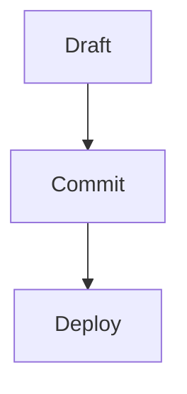

# Authoring Guide

This repo uses Jekyll Chirpy for a GitHub Pages blog.

## 1. Write a post

Create a new file in `_posts` with this format:

`YYYY-MM-DD-slug.md`

Examples:

- `2026-04-06-first-post.md`
- `2026-04-06-daily-note.md`

Use one of these templates:

- `docs/templates/post-tech.md`
- `docs/templates/post-diary.md`

If you want Mermaid diagrams in a post, add `mermaid: true` to the front matter and use a `mermaid` code block in the body.

Example:

````md
---
title: "Diagram Post"
date: 2026-04-07 10:00:00 +0900
categories: [tech]
tags: [mermaid]
mermaid: true
---


````

## 2. Change the intro page

Edit `_tabs/about.md`.

That file controls the content shown on the `/about/` page.

## 3. Change the profile image

1. Put an image file in `assets/img/`
2. Set the `avatar` field in `_config.yml`

Example:

```yml
avatar: /assets/img/profile.jpg
```

Supported examples:

- `/assets/img/profile.jpg`
- `https://example.com/profile.png`

## 4. Change the site intro text

Edit these fields in `_config.yml`:

```yml
title: "haeli.log"
tagline: "tech blog and diary"
description: "Notes on development and everyday life."
```

These values appear in the sidebar, metadata, and previews.

## 5. Optional social links

Edit `_config.yml`:

```yml
social:
  name: haelime
  email: me@example.com
  links:
    - https://github.com/haelime
```

Keep `links` empty if you do not want footer profile links.

## 6. Categories used in this repo

- `tech` for technical posts
- `diary` for diary entries

## 7. Publish changes

Commit and push to GitHub.

If Pages source is set to `GitHub Actions`, the site will build and deploy automatically.
